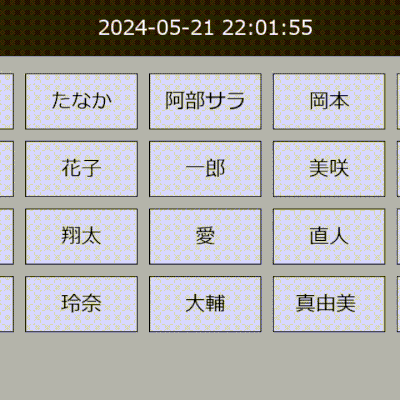

# 従業員タイムカードアプリとシフト計算機
*(English below)*(\n)

## 概要
このリポジトリには、従業員のシフトを効率的に管理し、総労働時間を計算するための従業員タイムカードアプリとシフト計算機が含まれています。このアプリケーションは、以下の2つの主要なコンポーネントに分かれています：
タイムカード.py：従業員が勤務時間を記録するために使用するメインアプリケーション。
アドミン.py：スタッフの詳細を追加、削除、編集し、総労働時間を計算する管理モジュール。
さらに、依存関係をインストールするためのバッチファイルと使用方法のHTMLファイルも含まれています。

## 機能
### タイムカードモジュール (タイムカード.py)
出勤/退勤：従業員はそれぞれのボタンをクリックして勤務時間を記録できます。
視覚的フィードバック：アプリケーションは、出勤および退勤時に視覚的なフィードバックと確認メッセージを提供します。
データストレージ：勤務時間は、月ごとに従業員ごとに整理されたExcelファイルに保存されます。
### アドミンモジュール (アドミン.py)
スタッフ管理：管理者はスタッフの詳細を追加、削除、編集できます。
時間計算：各従業員の総労働時間を自動的に計算し、Excelシートを更新します。
メニューインターフェース：管理機能へのナビゲーションに使用するシンプルなテキストベースのメニュー。

## インストール
リポジトリをクローンします：
```bash
git clone https://github.com/yourusername/employee-timecard-app.git
```
プロジェクトディレクトリに移動します：

```bash
cd TC
```
依存関係をインストールするためのバッチファイルを実行します：

```bash
./install_dependencies.bat
```
## 使用法
アプリケーションの実行方法
タイムカードモジュール：

```bash
python タイムカード.py
```
アドミンモジュール：

```bash
python アドミン.py
```
## 詳細な手順
プロジェクトディレクトリ内のreadme.htmlファイルを参照して、アプリケーションの使用方法に関する詳細な手順を確認してください。これには、以下の内容が含まれます：

管理モジュールでスタッフを追加、削除、編集する方法。
タイムカードモジュールで時間を記録する方法。
各従業員の総労働時間を計算する方法。

## ファイル構造
```bash
TC/
│
├── タイムカード.py          　 # 従業員用のメインアプリケーションファイル
├── アドミン.py             　  # スタッフを管理し、時間を計算する管理モジュール
├── installer.bat  　          # 依存関係をインストールするバッチファイル
├── Readme.html            　　# 詳細な使用方法
├── README.md             　　 # このファイル
└── requirements.txt      　　 # 依存関係のリスト（必要な場合）
```
## 貢献
リポジトリをフォークします。
あなたの機能ブランチを作成します（git checkout -b feature/your-feature）。
変更をコミットします（git commit -am 'Add your feature'）。
ブランチにプッシュします（git push origin feature/your-feature）。
新しいプルリクエストを作成します。

## ライセンス
このプロジェクトはMITライセンスの下でライセンスされています。詳細については、LICENSEファイルを参照してください。

<br>


# Employee Timecard App and Shift Calculator
## Overview
This repository contains an Employee Time Card App and Shift Calculator designed to efficiently manage employee shifts and calculate total hours worked. The application is divided into two main components:

タイムカード.py: The main application used by employees to log their working hours.
アドミン.py: The administration module for adding, removing, and editing staff details, and calculating total hours worked.
Additionally, the repository includes a batch file to install dependencies and an HTML file for usage instructions.

## Features
### Timecard Module (タイムカード.py)
Clock In/Clock Out: Employees can log their working hours by clicking their respective buttons.
Visual Feedback: The application provides visual feedback and confirmation messages upon clocking in and out.
Data Storage: Working hours are stored in an Excel file, organized by month and employee.
### Admin Module (アドミン.py)
Staff Management: Administrators can add, remove, and edit staff details.
Hour Calculation: Automatically calculates total hours worked for each employee and updates the Excel sheet.
Menu Interface: Simple text-based menu for navigating the administrative functions.

## Installation
Clone the repository:
```bash
git clone https://github.com/yourusername/employee-timecard-app.git
```
Navigate to the project directory:
```bash
cd TC
```
Run the batch file to install dependencies:
```bash
./install_dependencies.bat
```
## Usage
Running the Application
Timecard Module:
```bash
python タイムカード.py
```

Admin Module:
```bash
python アドミン.py
```

## Detailed Instructions
Refer to the readme.html file in the project directory for detailed instructions on how to use the application, including how to:

Add, remove, and edit staff in the admin module.
Log hours in the timecard module.
Calculate total hours worked for each employee.

## File Structure
```bash
employee-timecard-app/
│
├── タイムカード.py          　 # Main application file for employees
├── アドミン.py             　  # Admin module for managing staff and calculating hours
├── installer.bat  　          # Batch file for installing dependencies
├── Readme.html            　　# Detailed usage instructions
├── README.md             　　 # This file
└── requirements.txt      　　 # List of dependencies (if needed)
```
## Contributing
Fork the repository.
Create your feature branch (git checkout -b feature/your-feature).
Commit your changes (git commit -am 'Add your feature').
Push to the branch (git push origin feature/your-feature).
Create a new Pull Request.

## License
This project is licensed under the MIT License. See the LICENSE file for details.
